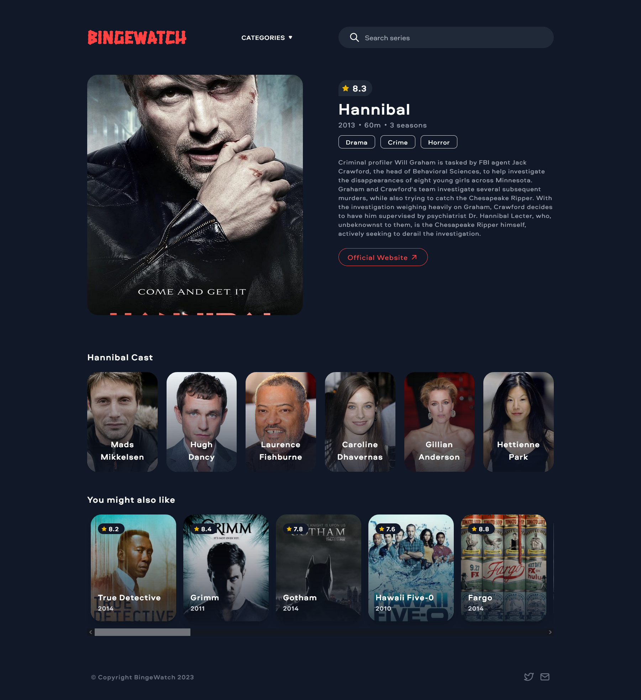

# Documentation
Welcome to BingeWatch - the best place fo find binge-worthy TV series. 📺🍿


## Quick Start
In order to start the project you should run the following commands in the base project folder:

```bash
# Install all dependencies
npm install

# Start server
npm run dev
```
You should be able to access the project on [http://localhost:8080](http://localhost:8080)

## Dependencies
- [Vue 3](https://vuejs.org/)
- [Vue Router](https://router.vuejs.org/)
- [Pinia](https://pinia.vuejs.org/) + [Pinia Persisted State](https://prazdevs.github.io/pinia-plugin-persistedstate/)
- [Tailwind CSS](https://tailwindcss.com)
- [Tabler Icons](https://tabler-icons.io/)
- [Vue3 Click Away](https://github.com/VinceG/vue-click-away)


## Project Structure
The project is divided in the following structure:
```text
├─ src
│  ├─ assets        // Assets such as images and CSS
│  ├─ components    // Universal Vue components.
│  ├─ models        // Data models - classes and interfaces
│  ├─ repositories  // Repositories that execute API calls
│  ├─ router        // Router configuration
│  ├─ utils         // General utility classes
│  ├─ stores        // Pinia stores
│  └─ views         // Pages
```

## Components
The components folder is hosts reusable components that are used throughout the project
- `/` - hosts specific components like Header, Footer, Search bar, etc. that can be reused
- `/kit` - hosts generic components like sections, dropdowns etc. 


## Views
The project is divided into 2 main views - "Home", "Show Details"
```text
├─ views
│  ├─ HomeView.vue           // Shows a catalog of TV shows divided into categories
│  ├─ ShowDetailsView.vue    // Shows the details of a specific TV show
```

#### Home
The entry point of the website which displays a catalog of curated TV shows divided into categories.


#### Show Details
A view which aims to provide details related to specific TV show



## Styling
All components and views are created from scratch, styled using **Tailwind CSS**, and based on the native elements

## Storage
To persist data required for the application to run the project uses:
- `Pinia` - the new "go-to" state management library introduced by the Vue.js
- `Local Storage (with the Pinia Data Persistence Plugin)` - allows the Pinia stores to be serialized and persisted. This way, the available state data can be accessed after a refresh or browser tab close event.

Currently the storage has the following stores:
- `tvShows` - stores and manages the TV shows fetched from an external API


#### Data Fetching
In order to fetch the countries data the project uses the native [Fetch API](https://developer.mozilla.org/en-US/docs/Web/API/Fetch_API)